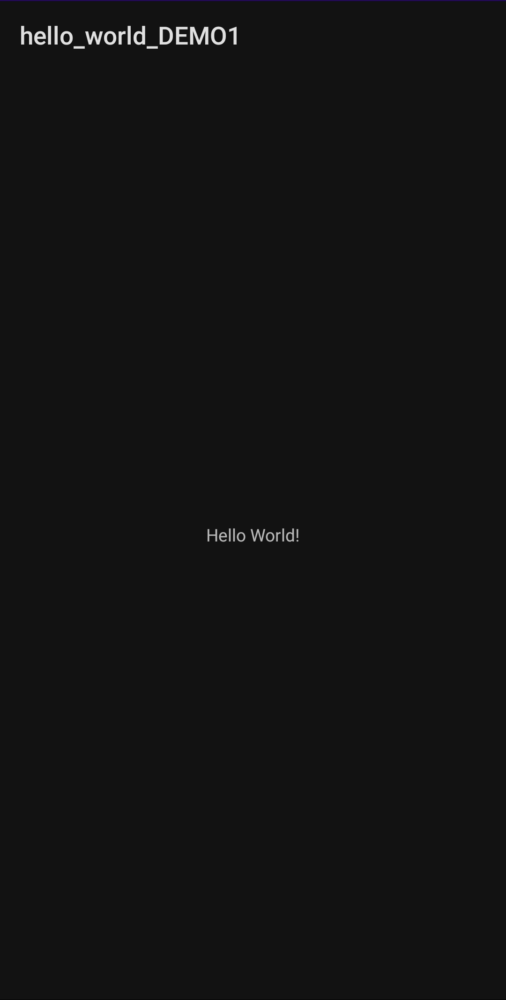
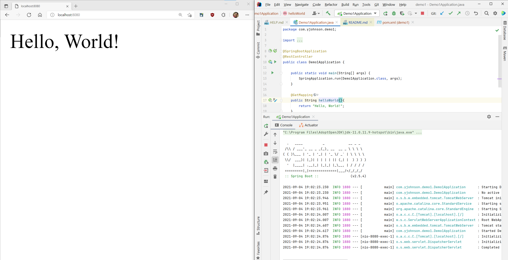
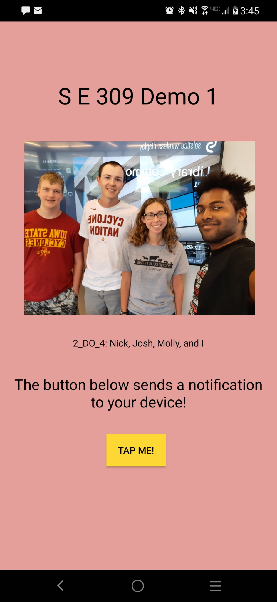
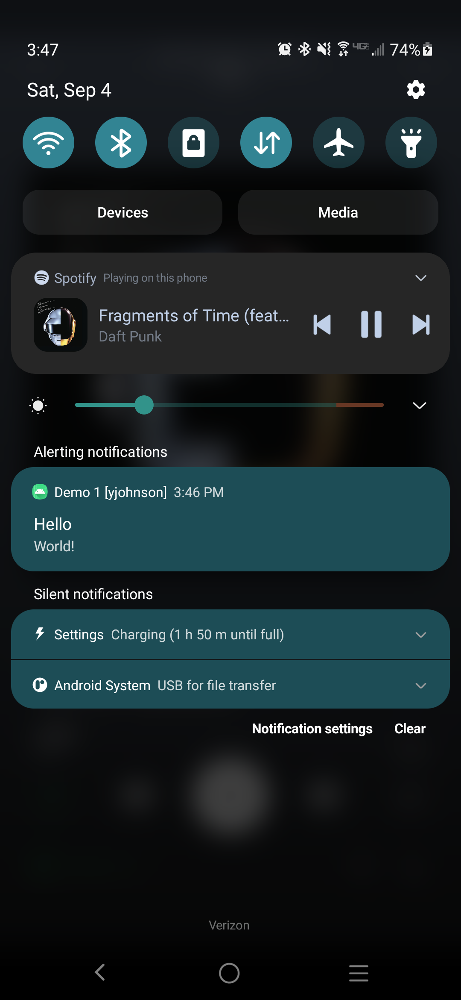

# Demo 1 - Yadiel Johnson

## Creating a Hello World application for Spring Boot

### 9/4/2021
1. Created a project in `2_do_4\experiments\yjohnson\demo1_springboot`.
	* This project is targeting Java 11.
2. Used IntelliJ's Spring Initializr to generate the default code.
3. Added a method to `Demo1Application.java` called `helloWorld()` with the `@GetMapping` annotation.
	* It simply returns "Hello, World!".

## Creating a Hello World application for Android

### 9/3/2021

1. Created a project in `2_do_4\experiments\yjohnson\demo1_android`.
	* This project targets Android 11 and was initialized with the `Empty Activity` preset.

2. Performed an initial run of the raw test application using Android Debugging Bridge to a personal device.
   > This is markedly simpler and arguably better for development as both the laptop and device can focus on doing
   > separate things.
   >
   > Without any modifications to the code, the following is generated onto the device:
   >
   > 
   >
   > This does not have much to it seeing as the activity was already pre-made to show "Hello World".
   >
   > *It is my intention to demonstrate something more substantial.*

3. Added a button to the main activity.
	1. Renamed the button to "Tap me!".
	2. Centered the button horizontally and set up vertical parent constraints.
	3. Changed the color to yellow.

### 9/4/2021

4. Used Google's provided boiler-plate code to create `createNotificationChannel()`.
	* This method must be invoked at startup to allow notification access.

5. Created a method in `MainActivity.java` called `sendNotif(View view)`.
	* This method sends a notification to the user's device with the text "Hello World!" divided into the context title
	  and text.
	* A simple notification ID system was set up to allow multiple runs of the demo.
	* Uses a default icon as it's notification icon.
6. Bound the button's `onClick()` action to `sendNotif()`.
	* This produces the expected result.
7. Abstracted the text portions of the application from the layout XML files to `res/values/strings.xml`.
8. Added text to describe the application further using `TextView` elements and modified them using attributes such
   as `theme/textAppearance`.
9. Added our group image to the main activity using `ImageView`.
10. Constrained most elements to their surrounding elements in such a way that the button and image were anchored to the
    parent view and everything else was vertically dependent on them.
11. Modified the colors within `res/values/themes.xml` to resemble ISU colors.
12. Changed the `AndroidManifest.xml` file to replace the theme with the following: `android:theme="@style/Theme.AppCompat.NoActionBar">`.
	* This was done to remove the action bar.

## Final Result
### Spring Boot
> 

### Android
> 
> 

